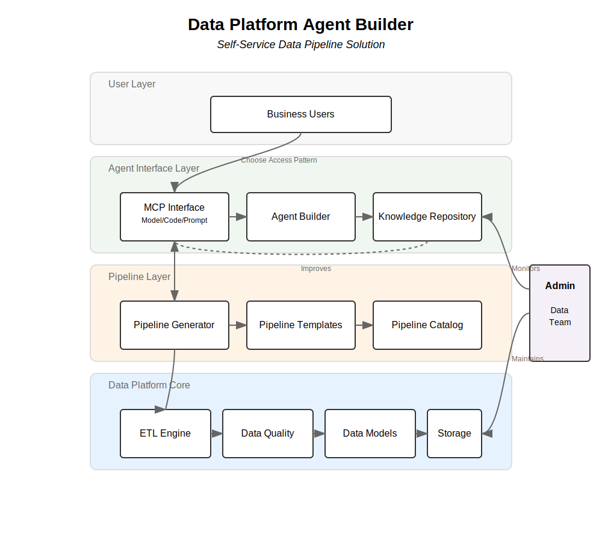

# Data Platform Agent Builder Architecture

## Core Concept
A flexible data platform that allows users to interact through Model/Code/Prompt (MCP) interfaces or intelligent agents, while maintaining a small data team footprint.

## Access Patterns

### Direct MCP Access
- **Model**: Visual pipeline builder for drag-and-drop operations
- **Code**: Direct SQL/Python interface for technical users
- **Prompt**: Natural language interface for simple queries

### Agent-Assisted Access
- Intelligent agents that build and manage pipelines
- Pattern learning and reuse
- Automated error handling and optimization

## Architecture Overview

## Key Components

### Interface Layer
- **MCP Interface**: Direct platform access through Model/Code/Prompt
- **Agent Interface**: AI-assisted pipeline creation and management
- **Knowledge Repository**: Stores successful patterns and solutions

### Pipeline Layer
- **Pipeline Generator**: Converts user inputs to technical pipelines
- **Pipeline Templates**: Pre-built components for common operations
- **Pipeline Catalog**: Registry of all created pipelines

### Data Platform Core
- **ETL Engine**: Underlying data integration technology
- **Data Quality**: Validation and monitoring
- **Data Models**: Structured representations of data
- **Storage**: Physical data repositories

### Admin Layer
- **Data Team**: Small team that maintains infrastructure
- **Platform Monitoring**: System health and performance tracking
- **Template Management**: Maintaining and updating pipeline templates

## User Workflow

1. User chooses access pattern:
   - Direct MCP for hands-on control
   - Agent-assisted for automated support
2. Platform generates appropriate pipeline
3. Pipeline executes on data platform core
4. Results delivered to user
5. Patterns stored for future optimization