# Modern Data Platform Architecture

## Overview
A modular data platform leveraging modern data stack components with interchangeable tools at each layer.

## Architecture Layers

### 1. Data Ingestion Layer
Supported tools:
- Airbyte (Open Source)
- Data Load Tool (DLT)
- Fivetran (Commercial)
- Stitch (Commercial)

### 2. Orchestration Layer
Supported orchestrators:
- Dagster
- Mage
- Prefect
- Apache Airflow

### 3. Storage Layer
#### Data Lake
- AWS S3
- MinIO (Self-hosted)
- Google Cloud Storage
- Azure Blob Storage

#### Data Warehouse
- Snowflake
- BigQuery
- Redshift
- Databricks

### 4. Data Processing
Medallion Architecture:
- Bronze (Raw)
- Silver (Cleaned)
- Gold (Business Ready)

### 5. Data Marts
- Finance
- Marketing
- Operations
- Product

### 6. Data Visualization
- Preset
- Metabase
- Superset
- Tableau

## Data Flow

1. Source Systems → Ingestion Layer
2. Ingestion Layer → Data Lake (Bronze)
3. Bronze → Silver (Cleaning/Validation)
4. Silver → Gold (Business Logic)
5. Gold → Data Marts
6. Data Marts → Visualization

## Tool Selection Matrix

| Layer | Open Source | Commercial | Self-Hosted |
|-------|-------------|------------|-------------|
| Ingestion | Airbyte, DLT | Fivetran, Stitch | Airbyte |
| Orchestration | Dagster, Mage | Cloud Providers | All |
| Storage | MinIO | Cloud Storage | MinIO |
| Processing | dbt | Databricks | dbt |
| Visualization | Superset | Tableau | All |

## Configuration Management

Tool selection is managed through configuration files:

````yaml
// filepath: config/stack_config.yaml
platform:
  ingestion:
    tool: airbyte
    config:
      host: localhost
      port: 8000
  
  orchestrator:
    tool: dagster
    config:
      scheduler: true
      retention_days: 30
  
  storage:
    data_lake:
      provider: minio
      config:
        endpoint: localhost:9000
        access_key: ${MINIO_ACCESS_KEY}
        secret_key: ${MINIO_SECRET_KEY}
    
    data_warehouse:
      provider: snowflake
      config:
        account: ${SNOWFLAKE_ACCOUNT}
        warehouse: compute_wh
        database: analytics
  
  processing:
    tool: dbt
    config:
      profiles_dir: ~/.dbt
      target: dev
  
  visualization:
    tool: preset
    config:
      host: preset.organization.com
      api_key: ${PRESET_API_KEY}

````
## Implementation Strategy

1. **Base Setup**
   - Deploy core infrastructure
   - Setup basic monitoring
   - Configure security

2. **Tool Integration**
   - Create abstraction layers
   - Implement connectors
   - Define interfaces

3. **Development Flow**
   - Source control setup
   - CI/CD pipeline
   - Testing framework

4. **Documentation**
   - Architecture diagrams
   - Configuration guides
   - Runbooks

## Architecture Diagram

```mermaid
%%{init: {
  'theme': 'base',
  'themeVariables': {
    'fontSize': '24px',
    'fontFamily': 'arial',
    'nodeSpacing': 50,
    'rankSpacing': 100,
    'primaryColor': '#1f77b4',
    'primaryTextColor': '#333',
    'lineColor': '#666'
  }
}}%%

graph TB
    %% Source Systems
    subgraph SRC["🔗 Source Systems"]
        direction LR
        S1["📡 APIs<br/><small>REST/GraphQL</small>"] 
        S2["💾 Databases<br/><small>SQL/NoSQL</small>"] 
        S3["📁 Files<br/><small>CSV/JSON</small>"]
        S1 --- S2 --- S3
        style SRC fill:#e3f2fd,stroke:#1f77b4,stroke-width:2px
    end

    %% Ingestion Layer
    subgraph ING["⚡ Data Ingestion"]
        direction LR
        I1["🔄 Airbyte<br/><small>Connectors</small>"] 
        I2["🐍 DLT<br/><small>Python ETL</small>"]
        I1 --- I2
        style ING fill:#e8f5e9,stroke:#2e7d32,stroke-width:2px
    end

    %% Orchestration
    subgraph ORCH["⚙️ Orchestration"]
        direction LR
        O1["📊 Dagster<br/><small>Assets</small>"] 
        O2["🎯 Mage<br/><small>Pipelines</small>"]
        O1 --- O2
        style ORCH fill:#f3e5f5,stroke:#7b1fa2,stroke-width:2px
    end

    %% Data Lake
    subgraph LAKE["💧 Data Lake"]
        direction LR
        B["🥉 Bronze<br/><small>Raw Data</small>"]
        S["🥈 Silver<br/><small>Cleaned Data</small>"]
        G["🥇 Gold<br/><small>Business Logic</small>"]
        B --- S --- G
        style LAKE fill:#fff3e0,stroke:#ef6c00,stroke-width:2px
    end

    %% Data Warehouse
    subgraph DW["🏢 Data Warehouse"]
        direction LR
        F["💰 Finance<br/><small>Mart</small>"] 
        M["📈 Marketing<br/><small>Mart</small>"] 
        O["⚡ Operations<br/><small>Mart</small>"]
        F --- M --- O
        style DW fill:#e8eaf6,stroke:#283593,stroke-width:2px
    end

    %% Visualization
    subgraph VIZ["📊 Visualization"]
        direction LR
        V1["📈 Preset<br/><small>Dashboards</small>"] 
        V2["📊 Metabase<br/><small>Reports</small>"]
        V1 --- V2
        style VIZ fill:#e0f2f1,stroke:#00695c,stroke-width:2px
    end

    %% Vertical Connections with curved arrows and labels
    SRC --->|"Extract"| ING
    ING --->|"Schedule"| ORCH
    ORCH --->|"Load"| LAKE
    LAKE --->|"Model"| DW
    DW --->|"Analyze"| VIZ

    %% Styling for nodes and connections
    classDef default fontSize:24px,padding:20px,margin:20px,width:200px,rx:10,ry:10
    classDef connection fontSize:18px,fill:none,stroke:#666,stroke-width:4px
    linkStyle default stroke:#666,stroke-width:3px,fill:none,stroke-dasharray:0
    
    %% Style all nodes with gradient backgrounds
    style S1 fill:#ffffff,stroke:#1f77b4,stroke-width:2px
    style S2 fill:#ffffff,stroke:#1f77b4,stroke-width:2px
    style S3 fill:#ffffff,stroke:#1f77b4,stroke-width:2px
    style I1 fill:#ffffff,stroke:#2e7d32,stroke-width:2px
    style I2 fill:#ffffff,stroke:#2e7d32,stroke-width:2px
    style O1 fill:#ffffff,stroke:#7b1fa2,stroke-width:2px
    style O2 fill:#ffffff,stroke:#7b1fa2,stroke-width:2px
    style B fill:#ffffff,stroke:#ef6c00,stroke-width:2px
    style S fill:#ffffff,stroke:#ef6c00,stroke-width:2px
    style G fill:#ffffff,stroke:#ef6c00,stroke-width:2px
    style F fill:#ffffff,stroke:#283593,stroke-width:2px
    style M fill:#ffffff,stroke:#283593,stroke-width:2px
    style O fill:#ffffff,stroke:#283593,stroke-width:2px
    style V1 fill:#ffffff,stroke:#00695c,stroke-width:2px
    style V2 fill:#ffffff,stroke:#00695c,stroke-width:2px
```

