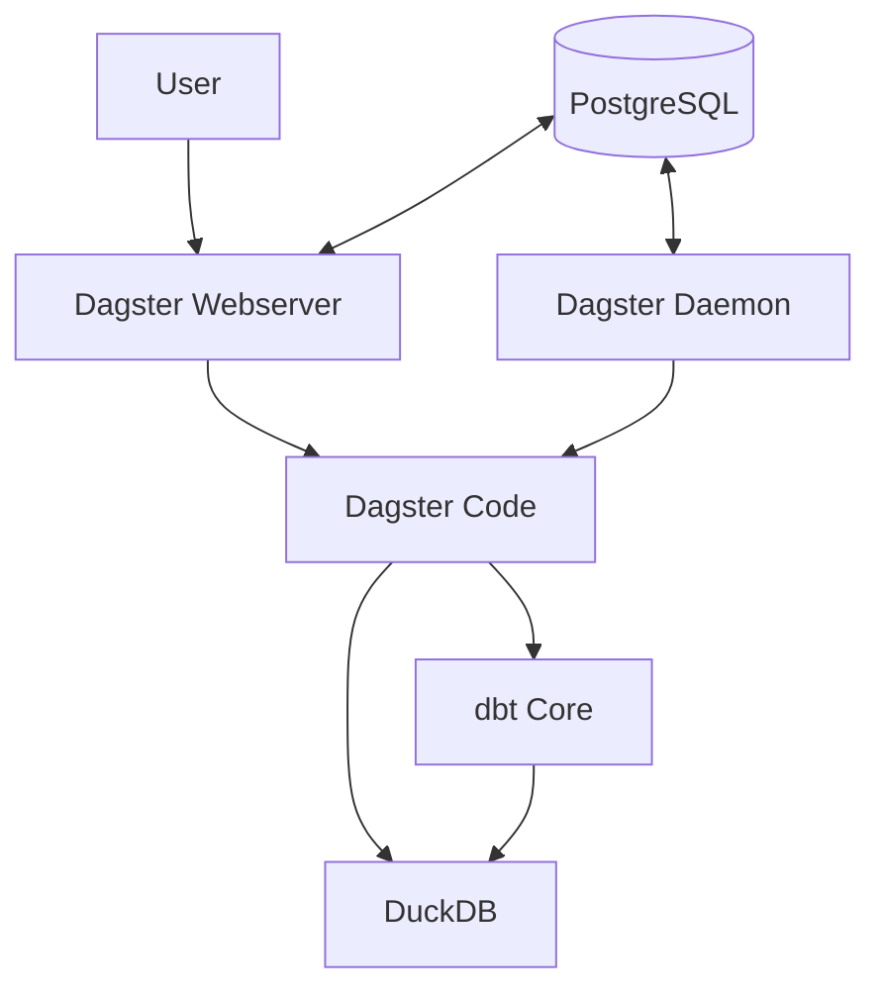

# Data Platform Infrastructure

This directory contains the infrastructure setup for the data platform using Docker.

## Core Components

- **Dagster Webserver**: UI server (Port 3001)
- **Dagster Daemon**: Background process for schedules and sensors
- **Dagster Code**: User code deployed as a separate service

## Integrated Tools

The following tools are integrated within the Dagster environment:

- **dbt**: Data transformation (installed within Dagster)
- **DuckDB**: Database engine (installed within Dagster)

## Setup

1. Build and start the services:
```bash
cd docker-compose
docker-compose up -d
```

2. Access the components:
- Dagster UI: http://localhost:3001

## Architecture



The architecture follows a clear separation of concerns:

- **Metadata Layer**: PostgreSQL stores all Dagster metadata including:
  - Run history
  - Event logs
  - Schedule state
  - Job definitions

- **Orchestration Layer**: The three Dagster services work together:
  - Webserver provides UI and API endpoints
  - Daemon handles scheduled executions and monitoring
  - Code service hosts user-defined assets and jobs

- **Processing Layer**: dbt handles transformations within DuckDB

## Directory Structure
```
infrastructure/data-platform/
├── dagster/
│   ├── Dockerfile         # Shared image for all Dagster services
│   ├── requirements.txt   # Dependencies including dbt and DuckDB
│   ├── workspace.yaml     # Code location configuration
│   └── dagster.yaml       # Dagster instance configuration
└── docker-compose/
    └── docker-compose.yaml
```

## Application Code Structure
```
code/
└── data-platform/
    ├── core/
    │   ├── orchestration/
    │   │   └── dagster/    # Dagster pipelines, assets, resources
    │   └── processing/
    │       └── dbt/        # dbt models, macros, tests
    └── examples/           # Example implementations
```

## Service Configuration

The platform consists of three primary Dagster services:

1. **dagster-webserver**: Serves the UI and handles user requests
2. **dagster-daemon**: Runs schedules, sensors, and automated tasks
3. **dagster-code**: Hosts the user code (pipelines, assets, resources)

All services share the same Docker image but have different entry points and responsibility.

## Development Workflow

1. Write data pipelines in the `code/` directory
   - Dagster code: `code/data-platform/core/orchestration/dagster`
   - dbt models: `code/data-platform/core/processing/dbt`
2. Build and run the infrastructure with docker-compose
3. Access the Dagster UI to monitor and trigger operations